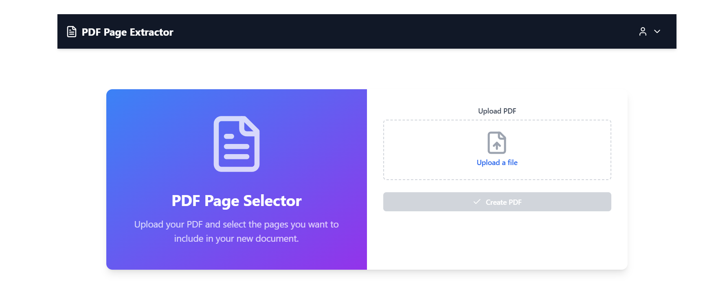
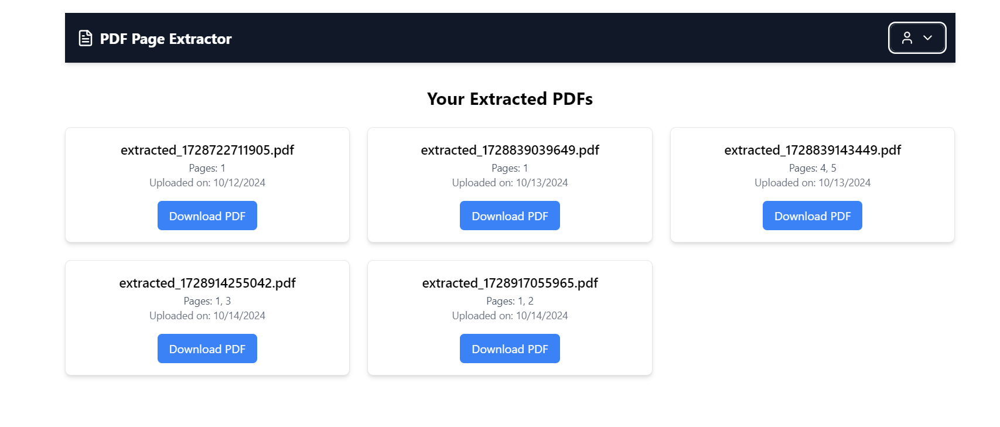

PDF Upload and Page Extraction Application
This project is a PDF manipulation service that allows users to upload a PDF document, select specific pages, and extract those pages into a new PDF document. The extracted PDF can then be downloaded for further use.

## Overview

This is an overview of my project.

Features
Upload PDF: Upload a PDF document to the server for processing.
Preview PDF Pages: Dynamically render and preview individual pages of the uploaded PDF.
Page Selection: Users can select which pages they want to extract from the uploaded PDF.
Extract PDF Pages: Extract the selected pages and download them as a new PDF file.
REST API: Backend API built using Express.js for handling PDF uploads and page extraction.
Cross-Origin Support: Supports Cross-Origin Resource Sharing (CORS) for communication between the frontend and backend.
Table of Contents
Installation
Usage
API Endpoints
Technologies Used
Contributing
License
Installation
Prerequisites
Ensure you have the following installed on your local development machine:

Node.js (version 14.x or above)
npm or yarn
Setup Instructions
Clone this repository:

bash
Copy code
git clone https://github.com/yasimjidhu/PDF-EXTRACTOR.git
cd PDF-EXTRACTOR
Install the project dependencies:

bash
Copy code
npm install
Create an uploads directory where the uploaded PDFs will be stored:

bash
Copy code
mkdir uploads
Start the server:

bash
Copy code
npm start
The server should now be running on http://localhost:5000.

Usage
Uploading and Extracting PDFs
Navigate to the frontend part of the application.
Upload a PDF file using the file input.
After uploading, a preview of the pages will appear, allowing you to select which pages to extract.
Select the desired pages and submit your request.
Download the newly extracted PDF.
API Endpoints
1. Upload PDF
URL: /upload
Method: POST
Description: Upload a PDF file to the server for processing.
Request Body: Multipart form data containing the PDF file.
Response: JSON object with the uploaded filename.
Example Request:

bash
Copy code
curl -X POST -F 'file=@example.pdf' http://localhost:5000/pdf/upload
2. Extract Pages
URL: /upload/extract
Method: POST
Description: Extract selected pages from the uploaded PDF and provide a download link for the new file.
Request Body:
selectedPages: An array of page numbers to extract.
filename: The name of the uploaded PDF file.
Response: JSON object with the download URL for the extracted PDF.
Example Request:

bash
Copy code
curl -X POST http://localhost:5000/pdf/upload/extract -d '{"selectedPages":[1,2,3],"filename":"example.pdf"}' -H "Content-Type: application/json"
Error Handling
If any errors occur during the upload or extraction process, a JSON object will be returned with an appropriate error message and status code.

Technologies Used
Backend:
__________

Node.js
Express.js
pdf-lib for PDF manipulation
Multer for file uploads
Frontend:
__________
React.js
pdfjs-dist for rendering PDF previews
Other:
CORS for cross-origin requests
Axios for making HTTP requests

Project Structure

PDF-EXTRACTOR/
├── backend/             # Backend files
│   ├── controllers/     # API controllers
│   ├── middlewares/     # middlewares 
│   ├── models/          # Database models
│   ├── routes/          # API routes
│   ├── uploads/         # Directory for uploaded PDFs
│   ├── config/          # Directory for configuration files
│   ├── server.js        # Main server file
├── frontend/            # Frontend files
│   ├── Public/          # Assets
│   ├── components/      # React components
│   ├── context/         # React contexts
│   ├── hooks/           # React hooks
│   ├── pages/           # pages
│   ├── redux/           # redux related files
│   ├── util/            # helper functions
│   ├── App.jsx          # Main app file
│   ├── Main.jsx         # app file
│   ├── App.css          # Main css file
│   ├── index.html       # Entry point for React app
├── README.md            # Project documentation
└── package.json         # Project metadata and dependencies

Contributing
Contributions are welcome! Please follow these steps to contribute:

Fork the repository.
Create a feature branch:
bash
Copy code
git checkout -b feature-branch
Commit your changes:
bash
Copy code
git commit -m 'Add some feature'
Push to the branch:
bash
Copy code
git push origin feature-branch
Create a new Pull Request.

License
This project is licensed under the MIT License. See the LICENSE file for details.